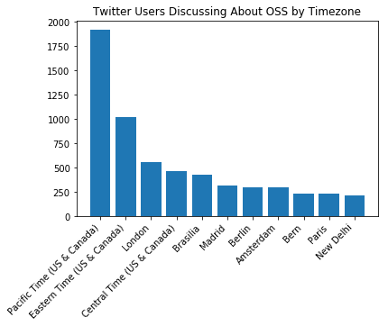
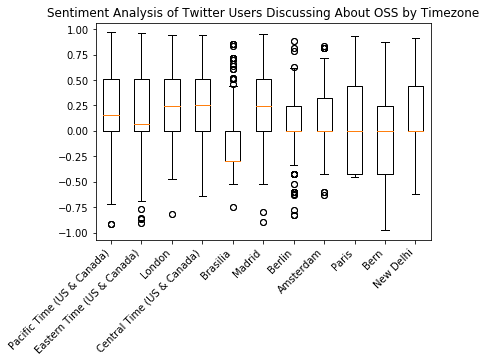
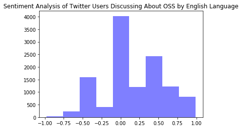
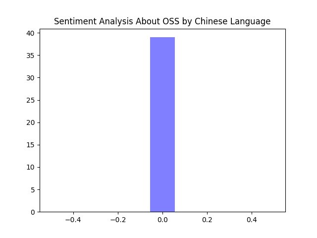
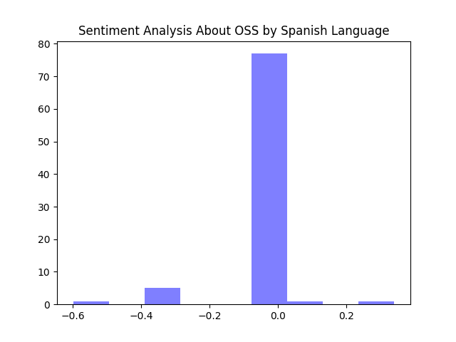
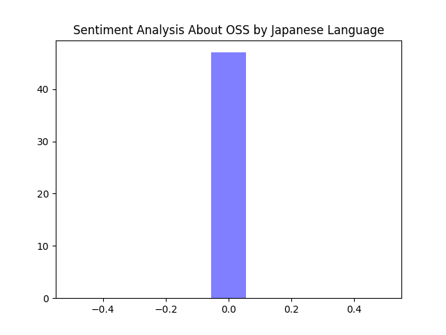

# Health Analysis of OSS Using Datum Extracted from Twitter Community

## Motivation

I wanted to analyze how people approach themes related to OSS and understand their feelings about it, so I've decided to gather data of people talking about OSS on Twitter and run a sentiment analysis tool to learn what kind of information I can extract from the datum and sort it as positive, negative or neutral. 
I believe that this kind of analysis is important to keep track on the community, it helps to understand more about how healthy is the environment we are, what's wrong with it, what's right and how we can improve it.

## Tools

I wanted to analyze people interacting about OSS and I imagined it'd be interesting to use Twitter data to make the analysis, Twitter is a social network widely used by people who are interested in OSS community and therefore there are lots of data to be used.

### Twitter API

I've used the [Twitter API](https://developer.twitter.com/en/docs) to extract data from Twitter. I've also used [agalea91](https://github.com/agalea91/twitter_search)'s `twitter_streaming.py` code with a few minor changes and updates to match the new version of Twitter API and to get the kind of data I was after.

### VADER

To make the sentiment analysis I chose the [VADER](https://github.com/cjhutto/vaderSentiment#introduction) tool because it was primarily developed to analyze microblogging and social media sites, especially Twitter. 

VADER uses [nltk](http://www.nltk.org/_modules/nltk/sentiment/vader.html) Python library and it sorts the outputs of its analysis upon strings as positive, negative or neutral. It also offers a compound polarity score which is a normalization of the sentiments that VADER identifies on the data, it's functioning is better explained [here](https://stackoverflow.com/questions/40325980/how-is-the-vader-compound-polarity-score-calculated-in-python-nltk) and I've used this piece of information to plots the graphs you'll see below.

### Python

All the code is written in Python 3. The reason why I chose Python is because it's a language that have an enormous community that creates awesome tools for it. I needed to run a sentiment analysis, deal with big json files and create graphs with the results and Python was the only language I found that offered me great quality tools for everything I needed. 

## Data

I've gathered data from users all around the world that used Twitter, filtering their messages using the following key-words:

* Open Source Software (English)
* open source software (English)
* मुक्त स्रोत सॉफ्टवेयर (Hindi)
* 开源软件 (Chinese) 
* オープンソースソフトウェア (Japanese)
* 오픈 소스 소프트웨어 (Korean)
* برمجيات مفتوحة المصدر (Arabic)
* software de código abierto (Spanish)
* Software de código aberto (Portuguese)
* software de código aberto (Portuguse)
* offene Quelle (German)
* Открытое программное обеспечение (Russian)

Unfortunately, my access to the Twitter API was very limited and I was only able to gather 8 days of data, from 03/12/2018 to 03/20/2018. 
The data, even though it isn't very extensive, is enough to have a general idea about the health of OSS communities around the world.

I've chosen to make an analysis based on the timezone that was setted in the person's twitter account because this was a common datum, there were very little dara about the country or city where the person was for most of Twitter's users.

I've also made an analysis based on the language spoken by users to see if there was any interesting connection between the idiom and the health of the OSS community around it.

There was considerable less data from languages other than English which made the quality of my analysis of these data decrease. Also, even though VADER is the best OSS tool I've found on the web it doesn't offer a great support for languages other than English and that might have affected the results on other languages also decreasing analysis quality.

I've included other languages on the analysis because I wanted to be as horizontal as possible not imposing English as the only relevant language when analyzing OSS communities.

## Results

### Relation of Users Discussing About OSS by Timezone

First I wanted to analyze how many people were talking about OSS around the world and I used the following code to help to do that:


```python
import collections
import json
import pandas as pd
import matplotlib.pyplot as plt
import numpy as np

from collections import Counter

def flatten(d, parent_key='', sep='_'):
    items = []
    for k, v in d.items():
        new_key = parent_key + sep + k if parent_key else k
        if isinstance(v, collections.MutableMapping):
            items.extend(flatten(v, new_key, sep=sep).items())
        else:
            items.append((new_key, v))
    return dict(items)

with open('data/total_data.py') as datafile:
    data = json.load(datafile)
    
for i in range (len(data)):
    data[i] = flatten(data[i])

dataframe = pd.DataFrame(data)

user_time_zone = dataframe['user_time_zone']
number_user_time_zone = Counter(user_time_zone)
del number_user_time_zone[None]
number_user_time_zone = number_user_time_zone.most_common(11)
 
Time_Zone = list(zip(*number_user_time_zone))[0]
Population = list(zip(*number_user_time_zone))[1]
x_pos = np.arange(len(Time_Zone))

plt.title('Twitter Users Discussing About OSS by Timezone')
plt.bar(x_pos, Population, align='center')
plt.xticks(x_pos, Time_Zone, rotation=45, ha='right')
plt.show()
```





What the code above is doing is receiving a json file that contains all the data that was used in the project and transforming it to a format that Pandas can understand, then it creates a `DataFrame` type from it. The number of times each timezone appears in the data is counted, then the data can be extracted and visualized in the graph you're seeing.

As it was expected there are many users that are from US and Canada and the place where there are most users by timezone are from the East Coast, home of many technology companies. 
But there are also some unexpected data, as a Brazilian I was surprised to learn that a considerable part of users who were talking about OSS were doing so from Brasília timezone. Berlin and Bern's timezones show a relevant amount of data when grouped.
I was also surprised to see such a low presence on India and China's timezones, even though they're relevant contributors to the OSS community, which makes me conclude that either the users from these timezones don't user Twitter a lot or that most of them chose not to share their timezones with Twitter.


### Sentiment Analysis of Twitter Users Discussing About OSS by Timezone

To understand more deeply these communities I've analyzed how positive, negative or neutral was the language they were using to talk about OSS:


```python
import collections
import json
import pandas as pd
import matplotlib.pyplot as plt
import numpy as np
import nltk
import twython
import pandas as pd

from nltk.sentiment.vader import SentimentIntensityAnalyzer
from collections import Counter

def flatten(d, parent_key='', sep='_'):
    items = []
    for k, v in d.items():
        new_key = parent_key + sep + k if parent_key else k
        if isinstance(v, collections.MutableMapping):
            items.extend(flatten(v, new_key, sep=sep).items())
        else:
            items.append((new_key, v))
    return dict(items)

with open('data/total_data.py') as datafile:
    data = json.load(datafile)
    
for i in range(len(data)):
    data[i] = flatten(data[i])

dataframe = pd.DataFrame(data)

time_zone_full_text = dataframe.loc[:, ['user_time_zone', 'full_text']]
time_zone_full_text = time_zone_full_text.mask(time_zone_full_text.eq('None')).dropna()

time_zone_full_text = time_zone_full_text.groupby('user_time_zone')
time_zone_counter = time_zone_full_text.count().sort_values(by='full_text', ascending=False)
time_zone_counter = time_zone_counter[:11]

sia = SentimentIntensityAnalyzer()

dict_sorted_time_zone_full_text = {}

for i in time_zone_counter.index:
    sorted_time_zone_full_text = time_zone_full_text.get_group(i)

    scores = []

    for j in sorted_time_zone_full_text.values:
        scores.append(sia.polarity_scores(j[1])['compound'])

    dict_sorted_time_zone_full_text[i] = scores

plt.title('Sentiment Analysis of Twitter Users Discussing About OSS by Timezone')    
plt.boxplot(dict_sorted_time_zone_full_text.values(), labels=dict_sorted_time_zone_full_text.keys())
plt.xticks(range(1, 12), dict_sorted_time_zone_full_text.keys(), rotation=45, ha='right')
plt.show()
 
```





This code does the same that the one before it. I've used Pandas to treat the data and I chose the timezones that returned more responses in my previous test to run the sentiment analysis using VADER tool.

By observing the box plot we can see that all timezones of the US and Canada have a more positive result, with the Pacific Time having a score of about 0.125, the Eastern Time 0.065 and Central Time with the highest rate of 0.250 in a 1.00 scale. London also had a positive result with an average score of 0.250. Brasília had the lowest score -0.375 and a big data variation with many positive results out of the curve. Madri did great on the sentiment analysis with an average of 0.250. Amsterdam had a lot of data variation and had a neutral score. Paris also had a neutral score and well distributed data, which means that there are more or less the same number of people talking positive and negative things about OSS. Bern had a neutral average score, but there are more people talking negative things about OSS than there are talking positive things. New Delhi kept a positive rate but had a neutral score, which means that even though their users used some positive language to talk about OSS most of them used a language classsified as neutral. 

Even though Brasilia, Paris and Bern have shown some negative reactions and talk about OSS, there is much more positive reactions related to OSS. The big data variation that Brasília shown has nothing to do with the language, I've manually checked the Brazilian-Portuguse json file, which is where I extract the data from and there isn't enough information to create such a big variation. I believe that, unfortunatly, there is a lot of negative reactions when people are talking about OSS in Brasília timezone.

### Sentiment Analysis of Twitter Users Discussing About OSS by Language

#### English Language analysis

I imagined it would also be interesting to analyze data paying attention to what languages users used. I wondered that I could make interesting connections between how users communicate in their own languages and how they communicate in English and this is the code I've used to create a histogram to visualize what's happening:


```python
import collections
import json
import pandas as pd
import matplotlib.pyplot as plt
import numpy as np
import nltk
import twython

from nltk.sentiment.vader import SentimentIntensityAnalyzer
from collections import Counter

def flatten(d, parent_key='', sep='_'):
    items = []
    for k, v in d.items():
        new_key = parent_key + sep + k if parent_key else k
        if isinstance(v, collections.MutableMapping):
            items.extend(flatten(v, new_key, sep=sep).items())
        else:
            items.append((new_key, v))
    return dict(items)

#Path to the data you want to analyze
path_sample_sentiment_analysis = "data/en/sample_sentiment_analysis.json"

with open(path_sample_sentiment_analysis) as datafile:
    data = json.load(datafile)
    
for i in range (len(data)):
    data[i] = flatten(data[i])

dataframe = pd.DataFrame(data)

#Path to the csv file you want to create after the data was analyzed
path_to_csv = 'data/en.csv'
dataframe['full_text'].to_csv(path_to_csv)

full_text = pd.read_csv(path_to_csv)
full_text = list(full_text.iloc[:, 1])

sia = SentimentIntensityAnalyzer()

scores =[]

for i in range(len(full_text)):
  scores.append(sia.polarity_scores(full_text[i])['compound'])

num_bins = 9
plt.title('Sentiment Analysis of Twitter Users Discussing About OSS by English Language')
n, bins, patches = plt.hist(scores, num_bins, facecolor='blue', alpha=0.5)
plt.show()
```





The code does the same than the above code, except that for this time it generates a histogram graph.

As we can see, most English speakers tend to use a neutral language to talk about things related to OSS on Twitter. But a bigger part of users use a positive language to talk about it. A smaller, but still representative quantity use negative words.

#### Other languages analysis

I've used the same code to generate histograms for Chinese, Spanish and Japanese, which were the languages that I could get more tweets from Twitter. You can check the results below:



Two things might have happened here, either the Chinese, Spanish and Japanese people have neutral opinion about OSS or the data was misread, if the second case is true, this was an expected output since VADER prevents its users that it doesn't deal as good with languages other than English. But the first case is also realistic because there were considerable less data from these languages than there were for English, an average of 100 tweets for each one of these languages versus more than 11000 tweets for the English analysis, it's reasonable to assume that most people just talk neutrally about topics related to OSS.


## Conclusion

As a conclusion to this project I'm convinced that Twitter is one of the many good sources to measure a community's health online. I felt like I would have stronger and more interesting results if I had access to more data, but given the conditions I believe that it was a productive study. I had a good amount of data to measure the health of the OSS community to English speakers and to people using the Canadian and American timezones.
The language used to talk about topics related to OSS in these timezones and by English speakers is positive in general, which is a good indicative that the community of Twitter is healthy.
